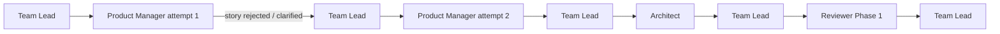

# Agentic Flow vX.Y.Z - run log

**Date:** YYYY-MM-DD
**Branch:** `branch-name`
**Scope:** Short description of this version / increment
**Compared to:** `vX.Y.Z`

---

## Version Updates

### Change Summary

Use this section to describe what changed in this version compared to the previous one.
Prefer concrete, implementation-focused entries.

| Area | How it was | What is changed | What is now |
|------|------------|-----------------|-------------|
| Example: Architect model fallback | Architect fallback was unstable and often resolved to the wrong model | Fallback chain was simplified and validated | Architect now uses a single verified model |
| | | | |
| | | | |

### Addressed Findings From Previous Log Analysis

List how the issues and suggestions from the previous log were handled in this version.
If one issue required multiple actions, list them in the same cell as separate bullets.

| Issue spotted | How was addressed | What pain point should be solved |
|---------------|-------------------|----------------------------------|
| Example: Coder fought with shell scripts and produced unreliable evidence | - Added dedicated verification scripts - Simplified required command flow - Reduced free-form shell usage in agent instructions | Fewer wasted loops, less random terminal behavior, more reliable handoffs |
| | | |
| | | |

## Flow Setup Diagram

Use this section to show the intended flow design for the version captured in this log.
The goal is to make the orchestration path and quality gates visible before the run notes start.

Suggested content:
- Which agent hands work to which next agent
- Which artifact is produced at each step
- Which file acts as the quality gate or handoff evidence
- Where the main approval points exist

### Planning Phase Diagram

```mermaid
flowchart LR
    TL1[1. Team Lead<br/>Requirement lock + checkpoint] -->|handoff: checkpoint + locked request| PM[2. Product Manager]
    PM -->|artifact: story| TL2[3. Team Lead<br/>Story gate]
    TL2 -->|artifact: artifacts/user-stories/<feature>.story.md| ARCH[4. Architect]
    ARCH -->|artifact: plan| TL3[5. Team Lead<br/>Plan gate]
    TL3 -->|artifacts: story + plan + checkpoint| REV1[6. Reviewer Phase 1]
    REV1 -->|artifact: artifacts/review-reports/<feature>.review.json| TL4[7. Team Lead<br/>Phase 1 gate]
```

### Implementation Phase Diagram

```mermaid
flowchart LR
    TL4[Phase 1 gate passed] -->|handoff: approved plan slices| CODER[8. Coder]
    CODER -->|artifacts: implementation report + verification log| TL5[9. Team Lead<br/>Coder gate]
    TL5 -->|artifacts: phase2 brief + approved implementation evidence| REV2[10. Reviewer Phase 2]
    REV2 -->|artifact: artifacts/review-reports/<feature>.review.json| TL6[11. Team Lead<br/>Final audit gate]
    TL6 -->|artifact: sign-off| SIGNOFF[12. Accepted delivery]
```

### Flow Step Clarification

Use this table to explain what each arrow means in the setup diagram.

| Phase | Step | Triggered by | Handoff / output | Quality gate |
|------|------|--------------|------------------|--------------|
| Planning | Team Lead -> Product Manager | Team Lead | Checkpoint + locked request | PM must produce a valid story artifact |
| Planning | Product Manager -> Team Lead | Product Manager | `artifacts/user-stories/<feature>.story.md` | Story preserves locked scope and acceptance criteria |
| Planning | Team Lead -> Architect | Team Lead | Checkpoint + approved story | Architect must produce an executable plan |
| Planning | Architect -> Team Lead | Architect | `artifacts/implementation-plans/<feature>.plan.md` | Plan includes slices, payloads, validation, logging, tests |
| Planning | Team Lead -> Reviewer Phase 1 | Team Lead | Request source + story + plan + checkpoint | Reviewer confirms implementation readiness |
| Planning | Reviewer Phase 1 -> Team Lead | Reviewer | `artifacts/review-reports/<feature>.review.json` | No `FAIL` or `BLOCKED` items in Phase 1 |
| Implementation | Team Lead -> Coder | Team Lead | Approved slices + checkpoint | Coder implements only approved scope |
| Implementation | Coder -> Team Lead | Coder | `artifacts/implementation-reports/<feature>.report.json` and `artifacts/implementation-reports/<feature>-verification.log` | Evidence must be complete and recheckable |
| Implementation | Team Lead -> Reviewer Phase 2 | Team Lead | Phase 2 brief + approved implementation evidence | Reviewer validates code, tests, runtime, and docs |
| Implementation | Reviewer Phase 2 -> Team Lead | Reviewer | `artifacts/review-reports/<feature>.review.json` | No unresolved verification gaps |
| Implementation | Team Lead -> Sign-off | Team Lead | `artifacts/implementation-signoffs/<feature>.signoff.json` | Final audit, rechecks, and acceptance completed |

---

## Run Notes (manually populated by user)

Use this section as a chronological list of observations from the run.

- 
- 
- 

## Post Run Checks (manually populated by user)

Use short status markers such as `PASS`, `FAIL`, `PARTIAL`, `NOT VERIFIED`.

| Check | Status | Notes |
|-------|--------|-------|
| Application has started without errors |  |  |
| Tests are green |  |  |
| Code-quality check passed |  |  |
| API is verified |  |  |
| Main story functionality is delivered |  |  |
| Run took (time) |  |  |
| Run used context (%) |  |  |
| Run took premium requests (optional) |  |  |

## Code Observations (manually populated by user)

Capture code quality, structure, naming, readability, test quality, architecture, and maintainability observations.

- 
- 
- 

## Bugs Identified (manually populated by user)

Describe confirmed bugs, missing behavior, requirement mismatches, or suspicious areas that still need verification.

- 
- 
- 

## User Suggestions (manually populated by user)

Use this section for improvement ideas for the next version of the flow, tooling, prompts, agent setup, verification, or coding standards.

- 
- 
- 

---

## Agent Analysis

**Analyzed by:** GitHub Copilot (Claude Opus)
**Analysis date:** YYYY-MM-DD
**Scope:** Full run analysis using this log, linked artifacts, generated code, and comparison with the previous version

### 1. Executive Summary

Provide a short, opinionated summary of the run:
- Was this version an improvement, regression, or mixed result?
- Did the workflow produce usable code?
- What were the 3-5 most important takeaways?

### 2. Run Snapshot

Summarize the run in a compact, comparable format.

| Dimension | Result | Notes |
|-----------|--------|-------|
| Outcome quality |  |  |
| Requirement fidelity |  |  |
| Code quality |  |  |
| Verification reliability |  |  |
| Agent coordination |  |  |
| Tooling effectiveness |  |  |
| Context efficiency |  |  |
| Time efficiency |  |  |

### 3. Observation Analysis

This section should heavily use the user-entered notes above and turn them into clear conclusions.

#### 3.1 What Worked Well

List the strongest parts of the run:
- Which agents behaved well
- Which workflow changes helped
- Which tools or templates worked
- Which quality or architecture choices should be kept

#### 3.2 What Failed or Regressed

Focus on the highest-impact failures first:
- Requirement loss
- Wrong model pickup
- Bad handoffs
- Verification false positives
- Context rot
- Random terminal behavior
- Poor code quality patterns
- Weak review value

For each important issue, explain:
- What happened
- Why it likely happened
- What impact it had on time, context, quality, or trust

#### 3.3 Bottleneck Analysis

Identify the biggest delivery bottlenecks across the run.

| Bottleneck | Evidence from run | Impact | Likely root cause |
|------------|-------------------|--------|-------------------|
|  |  |  |  |
|  |  |  |  |
|  |  |  |  |

#### 3.4 Agent-by-Agent Assessment

Evaluate each relevant role separately.

| Agent | What went well | What went wrong | Recommendation |
|-------|----------------|-----------------|----------------|
| Team Lead |  |  |  |
| Product Manager |  |  |  |
| Architect |  |  |  |
| Coder |  |  |  |
| Reviewer |  |  |  |

#### 3.5 Actual Flow Execution Diagram

Use this section to show how the flow actually behaved in this run based on the user notes and artifacts.
This is intentionally different from the setup diagram above.

Capture deviations such as:
- Context rot
- Rejected handoffs
- Repeated coder loops
- Reviewer reruns
- Missing artifacts
- Wrong model pickup
- Gate failures

##### Planning Phase - Actual

##### Implementation Phase - Actual

```mermaid
flowchart LR
    TL5[Phase 1 gate passed] --> CODER1[Coder batch / attempt 1]
    CODER1 --> TL6[Team Lead]
    TL6 -->|handoff rejected| CODER2[Coder retry]
    CODER2 --> TL7[Team Lead]
    TL7 -->|handoff rejected again if needed| CODER3[Coder retry]
    CODER3 --> TL8[Team Lead]
    TL8 --> REV2A[Reviewer Phase 2]
    REV2A -->|artifact mismatch / gate failed| TL9[Team Lead]
    TL9 --> REV2B[Reviewer rerun]
    REV2B --> TL10[Team Lead]
    TL10 --> SIGNOFF[Sign-off]
```

##### Actual Flow Step Clarification

Use this table to explain how the actual run deviated from the intended flow.

| Phase | Step / loop | What happened | Impact |
|------|-------------|---------------|--------|
| Planning | PM retry / story clarification |  |  |
| Planning | Architect / Phase 1 review path |  |  |
| Implementation | Coder handoff rejection loop |  |  |
| Implementation | Reviewer rerun / red card |  |  |
| Implementation | Final acceptance path |  |  |

Add a short explanation below the diagram:
- What the expected path was
- What the actual deviations were
- Which deviation had the biggest cost or quality impact

### 4. Cost And Context Efficiency

Use this section to explicitly analyze whether the run was cost-effective, not only whether it produced acceptable output.

#### 4.1 Cost Snapshot

| Cost dimension | Result | Notes |
|----------------|--------|-------|
| Total context used |  |  |
| Premium requests used |  |  |
| Most expensive phase |  |  |
| Most expensive agent |  |  |
| Number of costly reruns / loops |  |  |
| Cost efficiency verdict |  |  |

#### 4.2 Main Cost Drivers

Explain what consumed the most context, time, or premium requests.
Typical examples:
- Overly large plan artifacts
- Repeated coder retries
- Reviewer reruns with low added value
- Repeated terminal failures
- Weak handoffs causing rework
- Unnecessary model usage for low-value tasks

#### 4.3 Cost Reduction Actions

List concrete actions that should reduce context usage, premium requests, and wasted loops in the next run.

| Action | Expected savings | Trade-off / risk |
|--------|------------------|------------------|
|  |  |  |
|  |  |  |
|  |  |  |

### 5. Improvement Plan

Turn the observations into a concrete next-version plan.

#### 5.1 Priority Actions

Order actions by impact and urgency.

| Priority | Action | Why it matters | Expected impact | Owner |
|----------|--------|----------------|-----------------|-------|
| P1 |  |  |  |  |
| P1 |  |  |  |  |
| P2 |  |  |  |  |
| P3 |  |  |  |  |

#### 5.2 Recommended Prompt / Workflow Changes

Use this subsection for changes to:
- Agent instructions
- Handoff structure
- Model selection
- Red card or circuit breaker logic
- Validation gates
- Context management
- Tool permissions

#### 5.3 Recommended Tooling / Script Changes

Use this subsection for:
- New helper scripts
- Better verification flows
- Better quality gates
- Formatting / linting automation
- Test data and smoke test improvements

#### 5.4 Metrics To Track In The Next Run

Define measurable targets so future logs can compare results consistently.

| Metric | Current run | Next target |
|--------|-------------|-------------|
| Total run time |  |  |
| Context used |  |  |
| Premium requests used |  |  |
| Coder retry loops |  |  |
| Reviewer reruns |  |  |
| Manual fixes after run |  |  |

### 6. Code Change Analysis

This section should analyze the generated code itself, not only the process.

#### 6.1 Architecture and Boundaries

Review whether the produced code respects:
- Package structure
- Separation of concerns
- Domain / orchestration / integration boundaries
- DTO and mapper discipline
- Error handling location
- Configuration ownership

#### 6.2 Maintainability and Readability

Review:
- Naming quality
- Model count and necessity
- Null-handling patterns
- Constructor patterns
- Reuse vs duplication
- Auto-generated feel vs human-maintainable structure

#### 6.3 Testing and Verification Quality

Review:
- Test coverage depth
- Missing edge cases
- Correct test placement
- Usefulness of smoke tests
- Confidence level from verification evidence

#### 6.4 Risks and Follow-Up Refactors

List the most important technical risks that remain after the run.

| Risk | Why it matters | Recommended follow-up |
|------|----------------|-----------------------|
|  |  |  |
|  |  |  |
|  |  |  |

### 7. Final Verdict

Close with a direct conclusion:
- Is this version ready to keep as the new baseline?
- Which parts should definitely remain?
- Which parts should be changed before the next run?
- Is the system trending toward better quality/cost balance or away from it?

---

## Research Summary

- Reviewed previous run logs to identify stable sections, useful analysis patterns, and recurring pain points.
- Structured the template so user-entered observations can be reused directly by the analysis section.
- Added a stronger Opus-friendly analysis frame focused on bottlenecks, improvement planning, and code change quality.
