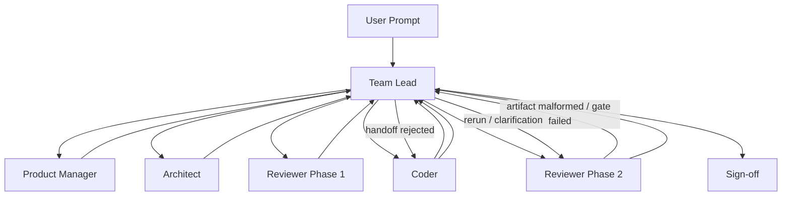

# Agentic Flow v2.3.0 - run log

**Date:** 2026-04-03
**Branch:** `v2.3.0`
**Scope:** Logging template standardization and run observability improvements
**Compared to:** `v2.2.0`

---

## Version Updates

### Change Summary

Use this section to describe what changed in this version compared to the previous one.
Prefer concrete, implementation-focused entries.

| Area | How it was | What is changed | What is now |
|------|------------|-----------------|-------------|
| Log template / observability | Run logs evolved organically across versions and had no single standard structure for comparing changes, findings, costs, and outcomes | Added a reusable `.github/agentic-flow/log-template.md` and used it as the baseline for new logs | Run logs now have a unified structure with explicit version updates, user observations, agent analysis, and cost/context tracking to improve observability |
| Code styling / consistency | Code formatting depended on manual habits, and several quality expectations from `documentation/code-guidance.md` still relied mainly on reviewer judgment instead of repo-enforced tooling | Added Spotless with `palantir-java-format` for `flow-orchestrator`, introduced a user-friendly `scripts/final-check.sh` wrapper for the final flow, aligned `mcp-server` formatting checks with Prettier, tightened Checkstyle naming/finality coverage, re-enabled SpotBugs defensive-copy enforcement, and removed the now-tool-enforced local-variable-finality rule from `code-guidance.md` | Agents and users now have a single final-check command for formatting plus verification, stronger automatic enforcement of code-quality and consistency rules, less reviewer-only interpretation for objective checks, and a cleaner guidance document focused on rules that still need human judgment |
| Project structure / naming conventions | Project structure and naming patterns had already improved in code, but the documentation still described them only partially and did not clearly define the naming suffixes used across layers | Updated `documentation/code-guidance.md` to document root package responsibilities, capability-root class placement, and naming conventions for `Service`, `Port`, `Adapter`, `Mapper`, `Properties`, `Request`, `Response`, `Dto`, and `Input`; aligned the high-level structure note in `.github/copilot-instructions.md` | The documented architecture now matches the current codebase more closely, which should reduce ambiguity in agent decisions and make package placement and naming more predictable |
| Agentic-flow review agent | Flow-level review relied mainly on the generic orchestration prompt and existing reviewer agents, which did not give a dedicated reviewer a fixed starting context for comparing the current run with the previous iteration | Added `.github/agents/flow-reviewer.agent.md` as a dedicated GitHub Copilot custom agent based on `.github/prompts/agentic-orchestration.prompt.md`; defined required context files, log selection rules, evidence-checking scope, and review output structure; set the model to `Claude Opus 4.6` | The flow can now be reviewed with a purpose-built Opus reviewer that starts from the right files, checks the latest and previous run logs explicitly, and produces more consistent, evidence-based agentic-flow analysis |

### Addressed Findings From Previous Log Analysis

List how the issues and suggestions from the previous log were handled in this version.
If one issue required multiple actions, list them in the same cell as separate bullets.

| Issue spotted | How was addressed | What pain point should be solved |
|---------------|-------------------|----------------------------------|
| | | |
| | | |

---

## Run Notes (manually populated by user)

Use this section as a chronological list of observations from the run.

- 
- 
- 

## Post Run Checks (manually populated by user)

Use short status markers such as `PASS`, `FAIL`, `PARTIAL`, `NOT VERIFIED`.

| Check | Status | Notes |
|-------|--------|-------|
| Application has started without errors |  |  |
| Tests are green |  |  |
| Code-quality check passed |  |  |
| API is verified |  |  |
| Main story functionality is delivered |  |  |
| Run took (time) |  |  |
| Run used context (%) |  |  |
| Run took premium requests (optional) |  |  |

## Code Observations (manually populated by user)

Capture code quality, structure, naming, readability, test quality, architecture, and maintainability observations.

- 
- 
- 

## Bugs Identified (manually populated by user)

Describe confirmed bugs, missing behavior, requirement mismatches, or suspicious areas that still need verification.

- 
- 
- 

## User Suggestions (manually populated by user)

Use this section for improvement ideas for the next version of the flow, tooling, prompts, agent setup, verification, or coding standards.

- 
- 
- 

---

## Agent Analysis

**Analyzed by:** GitHub Copilot (Claude Opus)
**Analysis date:** YYYY-MM-DD
**Scope:** Full run analysis using this log, linked artifacts, generated code, and comparison with the previous version

### 1. Executive Summary

Provide a short, opinionated summary of the run:
- Was this version an improvement, regression, or mixed result?
- Did the workflow produce usable code?
- What were the 3-5 most important takeaways?

### 2. Run Snapshot

Summarize the run in a compact, comparable format.

| Dimension | Result | Notes |
|-----------|--------|-------|
| Outcome quality |  |  |
| Requirement fidelity |  |  |
| Code quality |  |  |
| Verification reliability |  |  |
| Agent coordination |  |  |
| Tooling effectiveness |  |  |
| Context efficiency |  |  |
| Time efficiency |  |  |

### 3. Observation Analysis

This section should heavily use the user-entered notes above and turn them into clear conclusions.

#### 3.1 What Worked Well

List the strongest parts of the run:
- Which agents behaved well
- Which workflow changes helped
- Which tools or templates worked
- Which quality or architecture choices should be kept

#### 3.2 What Failed or Regressed

Focus on the highest-impact failures first:
- Requirement loss
- Wrong model pickup
- Bad handoffs
- Verification false positives
- Context rot
- Random terminal behavior
- Poor code quality patterns
- Weak review value

For each important issue, explain:
- What happened
- Why it likely happened
- What impact it had on time, context, quality, or trust

#### 3.3 Bottleneck Analysis

Identify the biggest delivery bottlenecks across the run.

| Bottleneck | Evidence from run | Impact | Likely root cause |
|------------|-------------------|--------|-------------------|
|  |  |  |  |
|  |  |  |  |
|  |  |  |  |

#### 3.4 Agent-by-Agent Assessment

Evaluate each relevant role separately.

| Agent | What went well | What went wrong | Recommendation |
|-------|----------------|-----------------|----------------|
| Team Lead |  |  |  |
| Product Manager |  |  |  |
| Architect |  |  |  |
| Coder |  |  |  |
| Reviewer |  |  |  |

#### 3.5 Actual Flow Execution Diagram

Use this section to show how the flow actually behaved in this run based on the user notes and artifacts.
This is intentionally different from the setup diagram above.

Capture deviations such as:
- Context rot
- Rejected handoffs
- Repeated coder loops
- Reviewer reruns
- Missing artifacts
- Wrong model pickup
- Gate failures

Add a short explanation below the diagram:
- What the expected path was
- What the actual deviations were
- Which deviation had the biggest cost or quality impact

### 4. Cost And Context Efficiency

Use this section to explicitly analyze whether the run was cost-effective, not only whether it produced acceptable output.

#### 4.1 Cost Snapshot

| Cost dimension | Result | Notes |
|----------------|--------|-------|
| Total context used |  |  |
| Premium requests used |  |  |
| Most expensive phase |  |  |
| Most expensive agent |  |  |
| Number of costly reruns / loops |  |  |
| Cost efficiency verdict |  |  |

#### 4.2 Main Cost Drivers

Explain what consumed the most context, time, or premium requests.
Typical examples:
- Overly large plan artifacts
- Repeated coder retries
- Reviewer reruns with low added value
- Repeated terminal failures
- Weak handoffs causing rework
- Unnecessary model usage for low-value tasks

#### 4.3 Cost Reduction Actions

List concrete actions that should reduce context usage, premium requests, and wasted loops in the next run.

| Action | Expected savings | Trade-off / risk |
|--------|------------------|------------------|
|  |  |  |
|  |  |  |
|  |  |  |

### 5. Improvement Plan

Turn the observations into a concrete next-version plan.

#### 5.1 Priority Actions

Order actions by impact and urgency.

| Priority | Action | Why it matters | Expected impact | Owner |
|----------|--------|----------------|-----------------|-------|
| P1 |  |  |  |  |
| P1 |  |  |  |  |
| P2 |  |  |  |  |
| P3 |  |  |  |  |

#### 5.2 Recommended Prompt / Workflow Changes

Use this subsection for changes to:
- Agent instructions
- Handoff structure
- Model selection
- Red card or circuit breaker logic
- Validation gates
- Context management
- Tool permissions

#### 5.3 Recommended Tooling / Script Changes

Use this subsection for:
- New helper scripts
- Better verification flows
- Better quality gates
- Formatting / linting automation
- Test data and smoke test improvements

#### 5.4 Metrics To Track In The Next Run

Define measurable targets so future logs can compare results consistently.

| Metric | Current run | Next target |
|--------|-------------|-------------|
| Total run time |  |  |
| Context used |  |  |
| Premium requests used |  |  |
| Coder retry loops |  |  |
| Reviewer reruns |  |  |
| Manual fixes after run |  |  |

### 6. Code Change Analysis

This section should analyze the generated code itself, not only the process.

#### 6.1 Architecture and Boundaries

Review whether the produced code respects:
- Package structure
- Separation of concerns
- Domain / orchestration / integration boundaries
- DTO and mapper discipline
- Error handling location
- Configuration ownership

#### 6.2 Maintainability and Readability

Review:
- Naming quality
- Model count and necessity
- Null-handling patterns
- Constructor patterns
- Reuse vs duplication
- Auto-generated feel vs human-maintainable structure

#### 6.3 Testing and Verification Quality

Review:
- Test coverage depth
- Missing edge cases
- Correct test placement
- Usefulness of smoke tests
- Confidence level from verification evidence

#### 6.4 Risks and Follow-Up Refactors

List the most important technical risks that remain after the run.

| Risk | Why it matters | Recommended follow-up |
|------|----------------|-----------------------|
|  |  |  |
|  |  |  |
|  |  |  |

### 7. Final Verdict

Close with a direct conclusion:
- Is this version ready to keep as the new baseline?
- Which parts should definitely remain?
- Which parts should be changed before the next run?
- Is the system trending toward better quality/cost balance or away from it?

---

## Research Summary

- Reused the shared run-log template as the baseline for the new version log.
- Seeded the first `Version Updates` entry with the new template adoption.
- Framed the change explicitly around improved observability across runs.
