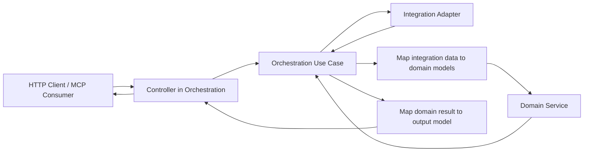

# GitlabFlow Copilot Instructions

## Project Overview

This repository has two main parts:

- `flow-orchestrator/`: the main Java application built with Spring Boot
- `mcp-server/`: a TypeScript MCP server that acts as a client of the Java application

The MCP server should stay thin. It should expose MCP tools and delegate business behavior to `flow-orchestrator` instead of re-implementing orchestration rules in TypeScript.

## Architecture

The Java application should preserve a clear separation of concerns:

- `orchestration`: controllers, application services, and use-case flow coordination
- `domain`: core business concepts, business rules, and domain models
- `integration`: adapters for external systems such as GitLab
- `config`: Spring configuration and bean wiring

Prefer dependencies that point inward:

- `orchestration` may depend on `domain` and `integration`
- `integration` must not depend on `domain`
- `domain` must not depend on `orchestration`
- `domain` must not depend on `integration`
- orchestration is the connector between the outer layers and the domain core

## Ports And Adapters

Use ports/adapters where they help keep external system concerns isolated.

Examples:

- orchestration decides when data should be fetched and what integration call is needed
- orchestration defines integration-agnostic ports and request/response contracts when needed
- `integration/gitlab` performs GitLab-specific HTTP calls and maps between orchestration contracts and GitLab DTOs
- domain services operate only on domain models and return domain models
- orchestration decides how domain results are returned to controllers, MCP consumers, or other callers
- keep GitLab HTTP clients, request DTOs, response DTOs, authentication, and URL/query mapping inside `integration/gitlab`

The target architecture is:

- domain is isolated and contains core logic only
- orchestration is the real connector between integration, domain, and outward-facing output
- integration remains an external adapter layer
- the orchestrator should work with different integrations over time
- do not let GitLab-specific models leak into domain logic

## Target Flow

This is the intended target during refactoring, even if some current code still does not fully match it:

Interpretation of the flow:

- orchestration decides when and what to fetch
- integration fetches data and returns it to orchestration
- orchestration maps that data into domain models
- domain executes business logic using only domain models
- domain returns a domain result to orchestration
- orchestration decides how to shape the result for the caller
- orchestration may apply output-specific mapping for HTTP, MCP, or future UI needs

Core rule:

- domain works only with its own models and must stay independent from orchestration and integration in every direction

## Boundary Rules

- Keep controllers in the `orchestration` package thin. They should validate input, call orchestration services, and map results.
- Keep orchestration focused on use-case flow, even when it also hosts controller entry points.
- Allow orchestration to define ports and generic integration-agnostic request/response models, but not GitLab transport details.
- Keep domain logic free from Spring, Feign, HTTP, and GitLab API details.
- Keep integration code responsible for external API specifics, DTO mapping, and adapter concerns.
- Prefer mapping GitLab DTOs to orchestration contracts inside `integration/gitlab` before data leaves the integration layer.
- Prefer mapping domain results to response or presentation models in orchestration before returning them outward.

If a model is GitLab-specific, keep it under `integration.gitlab`.
If a request or response model is intended to be shared with orchestration, it must stay integration-agnostic.
If a model represents core business meaning, place it in `domain`.
If a model is for transport, presentation, controller I/O, or external communication, keep it outside `domain`.

## Logging

Use SLF4J for logging. Do not log secrets, tokens, or sensitive payloads.

## Testing

Use JUnit 5, AssertJ, and Mockito for Java tests. Favor clear method separation so units are easy to test in isolation.

## Naming And Design Guidance

- choose names based on business intent, not framework mechanics
- prefer `*Port`, `*Adapter`, `*Service`, `*Mapper`, and `*Client` only when those names reflect the real responsibility
- avoid large service classes that mix orchestration, validation, mapping, domain logic, and integration concerns
- keep DTO suffixes for transport-layer objects only
- avoid leaking Feign request maps, GitLab response objects, or controller DTOs across layers
- avoid leaking orchestration-specific models into the domain layer
- avoid leaking GitLab-specific low-level details into orchestration, including endpoint paths, GitLab query parameter names, GitLab DTOs, Feign annotations, or GitLab response shapes

## GitLab API Documentation Workflow

- use [artifacts/reference-docs/gitLabAPI.md](/Users/alisia/Projects/aiProjects/GitlabFlow/artifacts/reference-docs/gitLabAPI.md) as the local reference when adding or changing any GitLab Feign endpoint
- before adding a new GitLab Feign client method, confirm the resource family and endpoint pattern in `artifacts/reference-docs/gitLabAPI.md`
- if the needed GitLab resource is missing from `artifacts/reference-docs/gitLabAPI.md`, add it as part of the same change
- when a GitLab Feign endpoint becomes used by FLOW, update the matching `Used in FLOW` cell in `artifacts/reference-docs/gitLabAPI.md` from `NO` to `TRUE`
- keep the GitLab integration code and `artifacts/reference-docs/gitLabAPI.md` in sync in the same pull request or change set

## MCP Server Guidance

The MCP server is not the source of business truth.

- keep MCP handlers lightweight
- call into the Java application for orchestration and business decisions
- avoid duplicating filtering, workflow rules, or integration-specific logic in TypeScript
- keep schemas and tool descriptions clear, but keep business workflows centralized in `flow-orchestrator`

## When Contributing

When adding new features:

1. Check project arhitecture and principles in `artifacts/constitution.md` before coding.
2. decide whether the behavior belongs in `orchestration`, `domain`, `integration`, or `mcp-server`
3. let orchestration coordinate the flow across integration and domain
4. keep domain logic in domain services operating on domain models only
5. implement adapter-specific behavior in the relevant integration package
6. if the change adds or updates a GitLab Feign endpoint, update `artifacts/reference-docs/gitLabAPI.md`
7. keep mapping explicit at layer boundaries
8. add or update focused tests

Optimize for clean boundaries, readability, a strongly isolated domain core, and future support for integrations beyond GitLab.
