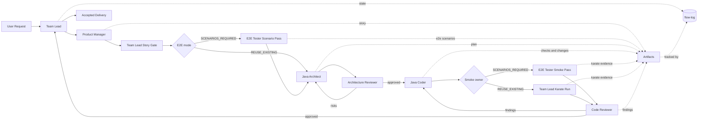

# GitlabFlow

GitlabFlow is an experiment in agentic orchestration for software delivery. The repository is used to design, test, and tighten a multi-agent workflow that can take a request, turn it into structured artifacts, implement it with controlled scope, and verify the result with independent review.

## Goal

Build a delivery flow that is useful in real engineering work, not just demo prompts.

The project aims to prove that an agent team can:

- keep requirements, plans, code changes, and review evidence connected
- reduce false-positive "done" states
- keep context compact enough for repeatable work across iterations
- produce code and delivery artifacts that are safe to trust

## Good Outcome

A good outcome for this experiment is a workflow where:

- each agent has a narrow responsibility and clear handoff
- the workflow state is machine-readable and traceable
- reviewers can verify claims from artifacts and checks, not chat text
- the team can improve prompts, tooling, and control rules from run to run

## Initial Idea

The initial idea is simple: treat delivery as an orchestrated system, not a single chat. Instead of asking one agent to do everything, split the work into planning, implementation, review, and acceptance stages, then persist the state of that flow in repository artifacts.

## Current Setup

The repository currently has four main parts:

- `flow-orchestrator/` - Spring Boot app used as the main implementation target
- `mcp-server/` - thin TypeScript client layer for user interaction
- `flow-log/` - CLI that stores and validates workflow state for each feature
- `.github/agentic-flow/` and `.github/agents/` - workflow rules, prompts, and operating guidance for the agent team

## Agentic Flow

## Artifacts And Flow-Log

The flow is grounded in files, not chat claims.

- `artifacts/user-stories/` stores the locked business-facing story
- `artifacts/e2e-scenarios/` stores approved E2E scenario coverage when smoke changes require dedicated authoring
- `artifacts/implementation-plans/` stores the executable implementation plan
- `artifacts/flow-logs/` stores the machine-owned workflow state for each feature
- `artifacts/check-logs/` stores persisted redacted verification logs for `check-log` follow-up
- `artifacts/code-reviews/` and `artifacts/refactoring/` capture review and iteration evidence

`flow-log` is the control point for this setup. It keeps the current feature state, approvals, slice-runs, E2E mode, risks, findings, and verification results in a single JSON file so each agent reads the same source of truth. Persisted redacted check logs keep failed verification evidence queryable without relying on chat history or terminal scrollback.

## Working Style

The experiment is currently focused on:

- small, explicit handoffs instead of large open-ended prompts
- durable review state instead of one-off comments
- script-backed verification instead of manual self-certification
- improving the workflow itself as much as the application code it delivers

## Useful Entry Points

- `.github/agentic-flow/agentic-flow-overview.md` - current workflow design
- `flow-log/README.md` - CLI behavior and state model
- `documentation/` - architecture, code, and project guidance
- `scripts/verify-quick.sh` and `scripts/final-check.sh` - main verification gates
